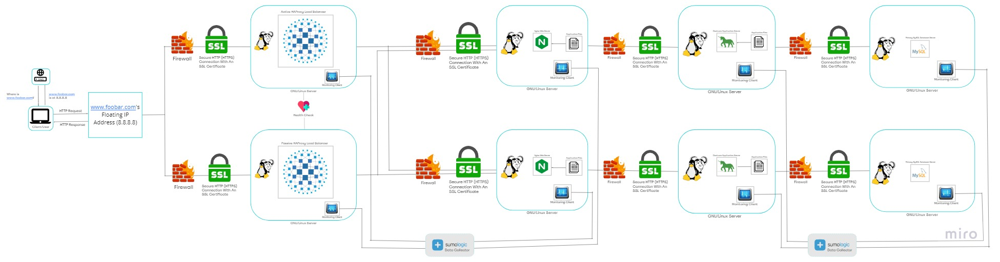

# Scaled Up Web Infrastructure

## Description:

This web infrastructure is an improved version of the framework described in the [previous](2-secured_and_monitored_web_infrastructure.md) edition. Significant modifications have been implemented in this improved version to remove Single Points of Failure (SPOFs) and improve overall resilience.
Each of the essential components, including the web server, application server, and database servers, has been methodically migrated to separate GNU/Linux servers in this enhanced version. The distribution of these components improves the infrastructure's resilience and fault tolerance, ultimately boosting its reliability.

## Specifics About This Infrastructure:

+ Firewalls have been added between each server   providing dedicated protection against unauthorized access.
The addition of a firewall to each server ensures that individual servers are shielded from unwanted intrusions and security breaches.

## Issues with This Infrastructure:

+ The introduction of more servers for each component results in higher maintenance costs.  
+ Procuring additional servers and the increased electricity consumption would contribute to an elevated operational expenditure.  
+ The company would need to allocate funds for purchasing servers and covering the increased energy consumption to sustain the expanded infrastructure.
